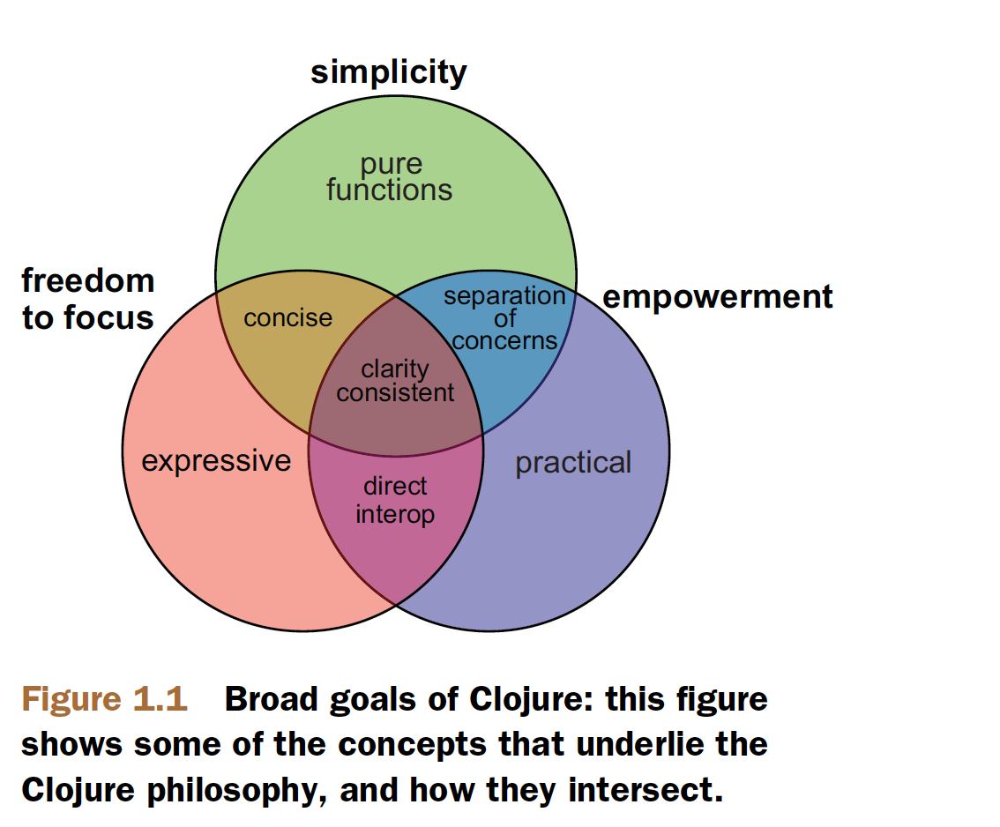

At my current company (Columinate at the time of writing) we write code in Clojure and ClojureScript. I have often been asked the question “Why Clojure?”. I hope to answer this question with this blog post and to highlight some of the key reason for choosing Clojure.
{: .lead}
<!–-break-–>

Clojure is a pragmatic dynamic language founded by Rich Hickey that endeavors to be a general purpose language that is suitable in areas where Java is suitable. It is opinionated and does not try to cover all the paradigms but instead provides the features needed to solve real-world problems. It allows developers to avoid the costs of maintaining a different infrastructure while leveraging existing libraries.

Rich Hickey wanted a **lisp** for **functional programming** that takes advantage of a **well-established platform** and is **designed for concurrency**.

The benefits of the language being a lisp are:
- homoiconicity (code as data and syntantic abstraction)
- minimal syntax
- not constraint by backwards compatibility

Clojure is a functional language with a dynamic emphasis, the benefits of this are:
- Immutable data structures
- First-class functions
- Dynamic polymorphism

The reason for taking advantage of established platforms is to avoid rebuilding the wheel and for this clojure uses the JVM. The JVM has  a proven track record, works across operating systems and is open.

Clojure was build with the following goals in mind:
- Simplicity
- Freedom to focus
- Empowerment

## Simplicity

Clojure strives to enable us to tackle complexity involving a variety of data types, multiple concurrent threads etc. without adding incidental complexity. An example of incidental complexity is how object-oriented languages require that runnable code is packaged in classes, inheritance and type declarations. Clojure puts emphasis on simplicity by encouraging the use of built-in data structures and the use of pure functions instead.

## Freedom to focus
Clojure keeps things simple, it has minimal syntax and does not require type declarations. It is expressive and is able to succinctly perform highly complicated tasks without sacrificing comprehensibility.

## Empowerment
Clojure serves to be practical by not going for fancy solutions which make life difficult for developers. The decision to use the JVM is an example of this. Though the JVM has some disadvantages such as slow start time, it is also a practical platform because it is mature and widely used.

References:
1. https://www.clojure.org/about/rationale
2. http://www.drdobbs.com/architecture-and-design/the-clojure-philosophy/240150710
